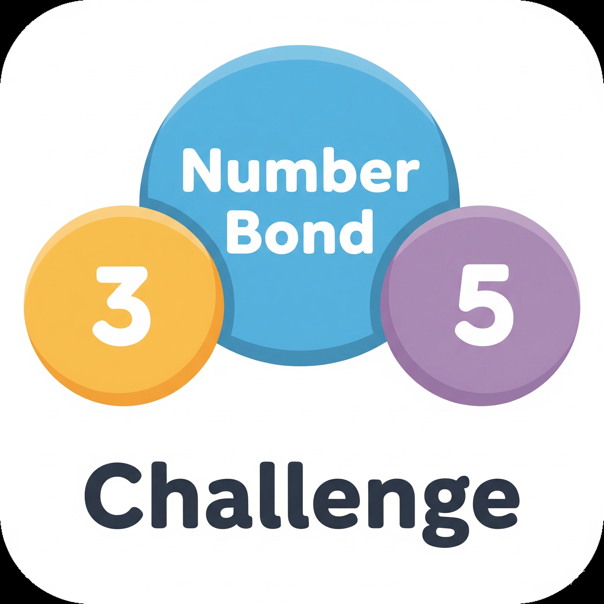
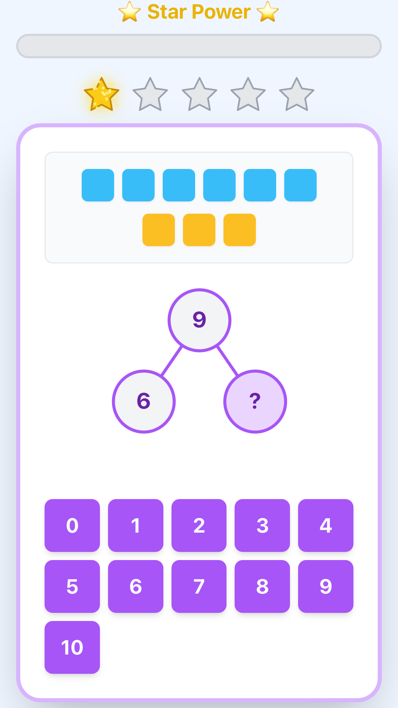

<br/>
<h1 align="center">
  
  Number Bond Challenge
</h1>

<p align="center">
  A fun and interactive math game designed to help children master number bonds, addition, and subtraction through engaging visuals and a rewarding progression system.
  <br/>
  <br/>
  <a href="https://numberbond.netlify.app">
    
  </a>
  <br/>
  
  
  
</p>

<br/>
<p align="center">
  
</p>

## About The Project

The **Number Bond Challenge** is an educational web application built with React to help young learners practice their foundational math skills. The game provides a multi-sensory learning experience, combining visual number bonds, interactive counting cubes, and positive reinforcement through animations and a star-based reward system. The difficulty is adjustable, making it suitable for children at various learning stages.

---
## 🚀 Live Demo

This application is deployed on Netlify and can be viewed at:

**[https://numberbond.netlify.app](https://numberbond.netlify.app)**

---
## Key Features

* **Interactive Number Bonds:** A clear, visual representation of the "part-part-whole" math concept.
* **Counting Cubes:** Clickable, color-coded cubes to help children visualize the problem and count the numbers.
* **Multiple Problem Types:** Automatically generates related addition and subtraction sentences to reinforce learning.
* **Rewarding Progression:**
    * A "Star Power" progress bar fills with each correct answer.
    * Filling the bar awards a glowing, sparkling star.
    * After earning 5 stars, the player "levels up" to a new set of colored stars.
* **Engaging Feedback:** Fun animations, like popping answers and confetti bursts, celebrate correct answers and goal completion.
* **Adjustable Difficulty:** The maximum total for problems can be easily changed to match the child's skill level.

---
## Built With

This project was built using modern web technologies:

* [**React**](https://reactjs.org/): A JavaScript library for building user interfaces.
* [**Vite**](https://vitejs.dev/): A next-generation frontend tooling for fast development.
* [**Tailwind CSS**](https://tailwindcss.com/): A utility-first CSS framework for rapid styling.
* [**Framer Motion**](https://www.framer.com/motion/): A production-ready animation library for React.

---
## Getting Started

To get a local copy up and running, follow these simple steps.

### Prerequisites

You will need to have **Node.js** and **npm** installed on your machine. You can download them from [nodejs.org](https://nodejs.org/).

### Installation

1.  **Clone the repository:**
    ```bash
    # TODO: Replace this with your own repository URL
    git clone [https://github.com/your_username/your_repository_name.git](https://github.com/your_username/your_repository_name.git)
    ```

2.  **Navigate to the project directory:**
    ```bash
    cd your_repository_name
    ```

3.  **Install NPM packages:**
    ```bash
    npm install
    ```

4.  **Run the development server:**
    ```bash
    npm run dev
    ```

Open [http://localhost:5173](http://localhost:5173) (or the address shown in your terminal) to view the app in your browser.